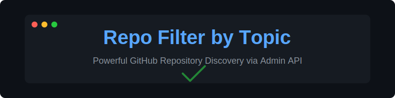
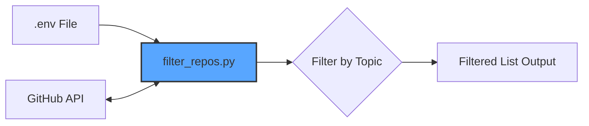

<p align="center">
  
</p>

<p align="center">
  
  
  
  
</p>

---

# 🚀 GitHub Repo Filter by Topic

**Efficiently discover and manage your GitHub repositories using topics and tags.**

Are you drowning in hundreds of repositories? This tool provides a professional-grade Python CLI to fetch and filter your GitHub repositories based on the **Topics** (tags) you've assigned. Leveraging the GitHub REST API and secure environment management, it's the ultimate utility for developers managing large portfolios.

## ✨ Key Features

- 🔍 **Topic-Based Filtering:** Instant lookup by any GitHub tag/topic.
- 📦 **Smart Pagination:** Automatically handles accounts with thousands of repositories.
- 🔐 **Secure Auth:** Uses `.env` for safe `ADMIN_TOKEN` (PAT) management.
- ⚡ **Lightweight:** Minimal dependencies (`requests`, `python-dotenv`).
- 🤖 **SEO Optimized:** Built for discoverability and clean documentation.

## 📸 How it Works (Visual Flow)



## 🛠️ Installation

1. **Clone the repository:**
   ```bash
   git clone https://github.com/yourusername/filter-git-repo-by-topic.git
   cd filter-git-repo-by-topic
   ```

2. **Install dependencies:**
   ```bash
   pip install -r requirements.txt
   ```
   *(Or simply `pip install requests python-dotenv`)*

3. **Configure Environment:**
   Create a `.env` file in the root directory and add your GitHub Fine-grained Personal Access Token:
   ```env
   ADMIN_TOKEN=github_pat_your_token_here
   ```

## 🚀 Usage

Simply run the script and specify the topic you want to search for:

```bash
python filter_repos.py <topic-name>
```

### 💡 Example:
To find all repositories tagged with **"automation"**:
```bash
python filter_repos.py automation
```

**Output:**
```text
Fetching repositories for the authenticated user...
Found 1973 repositories.

Repositories with topic 'automation':
- your-user/auto-deploy-script (https://github.com/your-user/auto-deploy-script)
- your-user/workflow-optimizer (https://github.com/your-user/workflow-optimizer)
```

## 🛡️ Security First

This project is designed with security in mind:
- **No Hardcoded Tokens:** Uses environment variables.
- **Git Ignore:** `.env` is automatically ignored to prevent accidental leaks.
- **Admin Scope:** Built to work with Fine-grained PATs for "Principle of Least Privilege".

## 🤝 Contributing

Contributions are welcome! If you have ideas for new features or improvements:
1. Fork the Project.
2. Create your Feature Branch (`git checkout -b feature/AmazingFeature`).
3. Commit your Changes (`git commit -m 'Add some AmazingFeature'`).
4. Push to the Branch (`git push origin feature/AmazingFeature`).
5. Open a Pull Request.

## 📄 License

Distributed under the MIT License. See `LICENSE` for more information.

---

<p align="center">
  Made with ❤️ by [Your Name]
</p>
